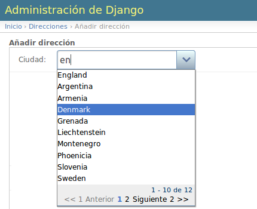

 # DJANGO Jquery Ajax Combobox Admin

Django Jquery Widget que reemplaza los clásicos combobox y los sustituye por un cuadro de texto con función de autocompletar y selección mediante desplegable.
Reemplaza todos los combos del admin de Django.
También puede usarse en formularios personalizados.



## Dependencias

[JQUERY](https://jquery.com/)

## Definir las siguientes variables en el settings
- Añadir la aplicación: django_jquery_ajax_combobox_admin
- Variable que activa/desactiva los combos en DjangoAdmin: USE_ADMIN_COMBOBOX
- Dirección completa del fichero javascript de Jquery: JS_JQUERY_URL
- Dirección completa del fichero CSS de Jquery: CSS_JQUERY_URL
- Dirección base de los ficheros del widget (HOST_URL + "django_jquery_ajax_combobox_admin"): AJAX_COMBOBOX_URL

###### Ejemplo settings.py
``` python
#Añadir aplicación
INSTALLED_APPS = list(INSTALLED_APPS)
INSTALLED_APPS.append('django_jquery_ajax_combobox_admin')
INSTALLED_APPS = tuple(INSTALLED_APPS)

#Activar combos en DjangoAdmin
USE_ADMIN_COMBOBOX = True

#URLS necesarias
JS_JQUERY_URL = MEDIA_URL + "/jquery-ui-1.7.2.custom/js/jquery-1.3.2.min.js"
CSS_JQUERY_URL = MEDIA_URL + "/jquery-ui-1.7.2.custom/css/ui-lightness/jquery-ui-1.7.2.custom.css"
#Sustituye http://0.0.0.0:8000/ por tu HOST_URL
AJAX_COMBOBOX_BASE_URL = "http://0.0.0.0:8000/django_jquery_ajax_combobox_admin"

```

## Copiar la carpeta django_jquery_ajax_combobox_admin a tu proyecto
Copiar la carpeta django_jquery_ajax_combobox_admin al directorio raíz de tu proyecto.

## Añadir al fichero urls.py de tu proyecto
``` python
urlpatterns += patterns('',
    (r'^django_jquery_ajax_combobox_admin/', include('django_jquery_ajax_combobox_admin.urls')),
)
```


## Uso en formularios

###### Python
``` python
from django_jquery_ajax_combobox_admin.widgets import AjaxComboBoxWidget

AjaxComboBoxWidget(model=ModelClass, attrs={"width": 500, "field": "nombre", "search_field": "nombre"})
```

## Options
- model: clase del modelo del que se obtienen los datos.
- attrs: diccionario con la configuración del widget.

##### attrs
|Key|Tipo|Por defecto|Descripción|
|:--|:--|:--|:--|
|url|string|'settings.AJAX_COMBOBOX_BASE_URL + 'json/json_api'|URL donde se generar los datos JSON|
|field|string|'unicode'|Campo que se mostrará en el combo. Se puede usar "unicode" si quiere mostrarse la representación unicode de los objetos.|
|base_query|string|''|Filtro base que se aplica siempre primero a los resultados del combo. Ej: codigo__startswith='41'|
|[search_field](http://www.usamimi.info/~sutara/ajax-combobox/sample/basic.html#sample01_04)|string|=field|Campo de búsqueda. Se puede usar "admin_search_fields" para buscar en los campos Model.Admin.search_fields. Acepta campos separados por coma. Ej: `'id, name, job'`|
|[and_or](http://www.usamimi.info/~sutara/ajax-combobox/sample/basic.html#sample01_05)|string|'OR'|Tipo de consulta sobre los search_field (AND / OR)|
|[order_by](http://www.usamimi.info/~sutara/ajax-combobox/sample/basic.html#sample01_06)|mixed|=search_field|Los campos de ordenación se indican separados por coma y el sentido de ordenación (ASC / DESC) al final separado por un espacio. Ej: `'name DESC'`, `['name ASC', 'age DESC']`|
|[lang](http://www.usamimi.info/~sutara/ajax-combobox/sample/basic.html#sample01_07)|string|os.environ["LANG"]|Idioma de los mensajes (se intenta obtener del sistema o se elige inglés) ('de', 'en', 'es', 'pt-br')|
|[per_page](http://www.usamimi.info/~sutara/ajax-combobox/sample/basic.html#sample01_02)|number|20|Nº de elementos por página|
|[navi_num](http://www.usamimi.info/~sutara/ajax-combobox/sample/basic.html#sample01_02)|number|5|Números de página que se muestran|
|button_img|string|settings.AJAX_COMBOBOX_BASE_URL + '/img/combobox_button.png'|Imagen del icono que expande la lista|
|loading_img|string|settings.AJAX_COMBOBOX_BASE_URL + '/img/ajax-loader.gif'|Sustituye a button_imagen mientras se expande la lista|
|[sub_info](http://www.usamimi.info/~sutara/ajax-combobox/sample/sub-info-basic/)|mixed|False|Muestra un subpanel junto a cada opción del combo (True / False / 'simple'). Por defecto: False.|
|[sub_as](http://www.usamimi.info/~sutara/ajax-combobox/sample/sub-info.html#sample02_02)|dict|{}|Diccionario para mostrar un alias en el subpanel en lugar del nombre del campo.  Ej: {"name": "Nombre", "code": "Código"}|
|[show_field](http://www.usamimi.info/~sutara/ajax-combobox/sample/sub-info.html#sample02_03)|string|'*'|Campos que se muestran en el subpanel. Ej: 'id, job, age'|
|hide_field|string|None|Campos que se ocultan en el subpanel.|

## License
[MIT](http://www.opensource.org/licenses/mit-license.php)

## Author
[Sergio Ruiz Bens]( <sergio.ruizbens@gmail.com> )

## Quotations
This plug-in use a modified version of jquery.ajax-combobox.
[Yuusaku Miyazaki](https://github.com/sutara79/jquery.ajax-combobox)

Usage: [jquery.ajax-combobox](http://www.usamimi.info/~sutara/ajax-combobox/sample/basic.html)
